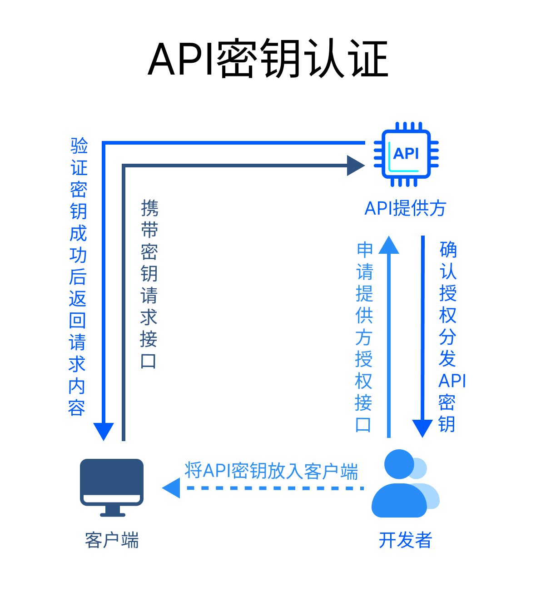

# Authorization

Authorization是HTTP 提供一个用于权限控制和认证的通用框架，可能有不少小伙伴会感到疑惑"**Cookie不就可以做权限控制和认证吗？**"，确实如此！ **Cookie确实是在单个系统内认证用户身份、保持会话状态的有效方式，但如果涉及到多个系统、多个域名或多个应用程序之间认证、授权呢？** 使用Cookie的话该如何办呢？是不是想想都头皮发麻呢？为解决这个问题， **HTTP急需一种更通用、更灵活的身份验证和授权机制，使跨系统和跨域的身份验证和授权管理更容易，这对于现代应用程序中的多样化环境非常重要，就这样Authorization诞生了！**

**Authorization是一种通用的、标准化的权限控制和认证的通用框架，它能够使跨系统和跨域的身份验证和授权管理更容易，使不同应用程序之间能够更轻松地实现单点登录（SSO）、用户身份验证和授权控制等。**


## Authorization的运行方式

Authorization仅是一个通用的认证框架，它并没有强制规定具体的使用方式，而是只提供了一种结构化的方式来管理身份验证和访问控制。它具体的身份验证方案和授权流程可以根据不同的需求和协议而有所不同，但大体的流程都如下图所示：


- **第一步客户端请求授权：** 客户端请求获得访问资源的授权，通常请求授权可以是账户密码登录/私秘钥等。
- **第二步服务端返回授权码/令牌：** 服务器收到客户端的授权请求后会验证其身份的有效性，如果有效则会给相应用户授权，并发送相应的授权码或令牌。
- **第三步客户端携带令牌请求内容：** 客户端在请求头`Authorization`中携带服务器返回的授权码/令牌发起请求。
- **第四步服务端携验证令牌：** 资源服务器接收到客户端请求，验证令牌的有效性和权限。这可能涉及验证签名、检查令牌的有效期和授权范围等。如果令牌有效且授权被授予，资源服务器允许客户端访问受保护的资源。

::: danger 注意

**无论是存放服务端返回的令牌或授权码，还是给请求头`Authorization`携带令牌，都需要客户端自行使用代码处理，浏览器并不会与处理Cookie一样自动保存/携带`Authorization`**

:::


## 常见的认证授权方案

上文介绍了Authorization仅是一个通用的认证授权框架，具体的身份验证方案和授权流程根据不同的协议和方案而有所不同并且对于一些特殊认证方案浏览器还有一些默认行为，因此为了更好的使用Authorization，我们应该进一步了解目前使用较为广泛且常见的认证方案与规范。


### Basic认证

**Basic认证方案是在 [RFC 7617](https://datatracker.ietf.org/doc/html/rfc7617) 中规定的，被称为基本身份认证，是一种用于HTTP的简单认证方案。该方案通过在HTTP请求中发送用户名和密码来进行身份验证。**


Basic认证的工作流程如下：

- 客户端发送一个请求到服务器。
- 如果服务器需要认证，它会返回一个401未授权的响应，同时在响应头中包含一个`WWW-Authenticate`字段，该字段值为`Basic realm="xxx"`，Basic表明请求该资源需要进行Basic认证，其中"xxx"是服务器对资源的描述。
- 客户端在接收到401响应后，会提示用户输入用户名和密码。然后，客户端将用户名和密码拼接成一个字符串，格式为"username"，并对这个字符串进行Base64编码。
- 客户端再次发送相同的请求，但这次在请求头中包含一个`Authorization`字段，该字段值为`Basic `后接上一步得到的Base64编码字符串。
- 服务器接收到请求后，解码`Authorization`字段的值，验证用户名和密码。如果验证通过，服务器就会处理请求并返回响应。如果验证失败，服务器会再次返回401响应。

::: danger  Basic认证并不安全

Basic认证并不安全，因为它只是简单地对用户名和密码进行Base64编码，而Base64编码是可以轻易解码的。因此，除非使用HTTPS等方式对通信进行加密，否则不应在需要高安全性的场合使用Basic认证。

:::


### Digest认证

**Digest认证方案是在 [RFC 7616](https://datatracker.ietf.org/doc/html/rfc7616) 中规定的，它是一种用于HTTP的认证方案，也被称为摘要认证，是基本认证（Basic Authentication）的一个改进版本，它提供了比基本认证更好的安全性。**


摘要认证的工作流程如下：

- 客户端发送一个请求到服务器。
- 如果服务器需要认证，它会返回一个401未授权的响应，同时在响应头中包含一个`WWW-Authenticate`字段，该字段值包含了认证方式（`Digest`）、一个随机生成的nonce值(`nonce`)、域名（`realm`）等信息。
- 客户端在接收到401响应后，会提示用户输入用户名和密码。待用户输入完成，客户端会使用服务器返回的nonce值、URL与用户名、密码相结合然后通过 MD5 加密生成哈希密钥也叫响应(response)值。
- 客户端再次发送相同的请求，但这次在请求头中包含一个`Authorization`字段，该字段值包含了认证方法(`Digest`)、用户名(`username`)、域名(`realm`)、nonce值(`none`)、响应值(`responese`)等信息。
- 服务器收到请求后，可以使用username查询到相应用户的密码，然后使用同样的方式生成响应值，最后与客户端的响应值比对，如果服务器的响应值与客户端的响应值一致，服务器就会处理请求并返回响应。

::: tip 提示

摘要认证的安全性比基本认证高，因为基本认证仅对传输的用户名、密码进了Basic64编码，相当于是以明文形式发送用户名和密码，而摘要认证向客户端提供了一次性使用编号（`nonce`），该编号与用户名、密码和 URL相结合并通过 MD5 加密生成哈希密钥(`response`响应值)，传输过程也是传输的哈希密钥，因此即使攻击者截获了认证信息，他们也无法直接得到用户的密码。

:::


### Bearer认证

**Bearer认证方案是在  [RFC 6750](https://datatracker.ietf.org/doc/html/rfc6750) 中规定的，它是一种用于HTTP的认证方案，也被称为Token(令牌)认证，它是基于[OAuth2.0](https://swagger.io/docs/specification/authentication/oauth2/)认证协议的认证方案**。该方案使用令牌(token)授权，令牌(token)就像你持有的一张人民币一样，只要你持有它，你就可以使用它，而不像银行卡需要输入账户密码，正因这个特性，它被广泛使用于跨系统和跨域的身份验证和授权中。


Bearer认证的工作流程如下：

- 客户端发送一个请求到服务器。
- 如果服务器需要请求第三方服务器资源，并且需要认证，此时它会返回一个401未授权的响应，同时返回一个第三方服务认证授权的地址。
- 客户端收到相应后会重定向到第三方服务认证授权的地址，待用户填写相应信息确认授权后，授权请求发送到第三方服务器。
- 第三方服务器收到授权请求后，判断认证信息是否正确，如果认证信息正确，服务器会生成一个Bearer令牌，并将其发送回客户端。这个令牌是一个长字符串，它代表了用户的身份。
- 客户端收到响应后，将令牌取出并存储起来，通常是在本地存储或者cookie中，存储过程需要开发人员自行操作。
- 客户端携带令牌`Authorization: Bearer <token>`，再次发出请求，携带令牌需要开发人员自行操作。
- 服务器收到令牌后会使用该令牌向第三方服务器继续请求资源。
- 第三方服务器收到请求后，会判断令牌是否有效，如果令牌验证成功，服务器就会处理请求并返回响应。

::: danger  Bearer认证需要严格注意令牌的被盗

由于Bearer令牌可以由任何人使用，如果令牌被盗，那么攻击者就可以冒充用户进行操作。因此，使用Bearer认证时，必须采取适当的安全措施，例如使用HTTPS来加密通信，定期刷新令牌等手段以防止令牌被窃取。

:::


### JWT认证

**JWT(JSON Web Token)认证与Bearer认证的原理是一样的，并且其运行流程也并无差异，他们的关键差别仅在于：**

- **令牌类型**：Bearer认证使用的令牌通常是一个随机生成的字符串，它本身不包含任何用户信息。而JWT是一种特殊的令牌，它是一个编码后的JSON对象，可以包含一些用户信息和其他元数据。
- **状态**：Bearer认证通常是状态性的，这意味着服务器需要存储令牌信息以便验证。而JWT是无状态的，因为JWT本身就包含了所有需要验证的信息，服务器不需要存储任何关于JWT的信息。
- **使用方式**：在使用方式上，JWT和Bearer认证都很相似。它们都是在HTTP请求的头部字段中发送的，格式通常是`Authorization: Bearer <token>`。这里的`<token>`可以是一个Bearer令牌，也可以是一个JWT。
- **安全性**：JWT可以使用数字签名或者加密来保证其安全性。而Bearer令牌的安全性主要依赖于HTTPS来防止令牌在传输过程中被窃取。


### API密钥认证 

**API密钥认证（API Key Authentication）是一种用于保护和控制对Web服务或API资源的访问的常见方式。它基于在每个请求中包含一个唯一的API密钥，以便服务器可以验证请求的合法性。这种认证方式通常用于对第三方开发者、应用程序或用户授予对API的有限访问权限。**



API密钥认证的工作流程如下：

- 生成API密钥：API提供者会生成一个唯一的API密钥，并将其分发给授权的开发者或应用程序
- 包含API密钥：在进行API请求时，开发者或应用程序需要在请求中包含他们的API密钥。这通常是通过在HTTP请求的头部、查询参数或请求体中添加密钥来实现的。
- 服务器验证：API服务器收到请求后，会提取其中的API密钥，并与存储的有效密钥进行比对。如果密钥有效且请求符合授权要求，服务器将允许请求继续处理；否则，服务器将返回相应的错误信息。
- 访问控制：一旦API密钥被验证通过，服务器可以根据密钥对应的权限级别，控制对API资源的访问权限。这可以包括限制每个密钥的请求速率、限制对特定资源的访问等。


### 双因素认证

**双因素认证（Two-Factor Authentication, 2FA）是一种身份验证方式，要求用户在登录时提供两种不同类型的身份验证信息，通常是"Something you know"（你所知道的）和"Something you have"（你所拥有的）。这种方式比单一密码更安全，因为即使密码泄露，仍需要第二种身份验证信息才能完成登录。**


双因素认证的工作流程如下：

- 用户尝试登录：用户在登录时输入其用户名和密码。
- 第一因素验证：系统验证用户名和密码的正确性。
- 第二因素验证：如果第一因素验证通过，系统会要求用户提供第二种身份验证信息。这通常是通过手机短信、手机应用程序生成的动态验证码、硬件安全密钥（如YubiKey）或生物识别信息（如指纹或面部识别）来实现的。
- 访问控制：一旦第二因素验证成功，用户将被授予访问权限。


### 其他一些认证方式

- **OpenID Connect**: 基于OAuth 2.0的身份认证协议，用于实现单点登录和获取用户身份信息。
- **SAML (Security Assertion Markup Language)**: 用于单点登录和跨域身份验证的XML标准协议。
- **Kerberos**: 一种网络身份验证协议，用于提供强化的网络安全。
- **LDAP (Lightweight Directory Access Protocol) Authentication**: 用于与目录服务（如Active Directory）通信以进行用户身份验证。
- **Biometric Authentication**: 使用生物识别技术，如指纹、面部识别、虹膜识别等进行身份验证。
- **Smart Card Authentication**: 使用智能卡进行身份验证，通常在高度安全的环境中使用。


## 相关的标头

从前面的内容我们可以知道，Authorization的运行主要依赖于`WWW-Authenticate`响应标头以及 `Authorization`请求标头，下面我们就详细介绍下两个标头的内容。


### WWW-Authenticate`响应标头`

**响应标头`WWW-Authenticate` 定义了获取特定资源的访问权限的认证方法。** 服务器将以 `401 Unauthorized`去响应访问受保护资源的请求，该响应必须包含至少一个 `WWW-Authenticate` 标头和一个质询，以指示客户端使用哪些身份验证方案访问资源（以及每个特定方案的任意额外的数据）。一个 `WWW-Authenticate` 标头中允许多个质询，并且一个响应中允许多个 `WWW-Authenticate` 标头。

**参数**

- **\<auth-scheme>**

  用于指定访问该资源需要进行的身份验证方案。一些更常见的身份验证方案是（不区分大小写）：`Basic`、`Digest`、`Negotiate` 和 `AWS4-HMAC-SHA256`。

- **realm="\<string>"** `可选`

  用于指定一段描述信息

除了上述的参数外，该标头对于不同的身份验证方案也有一些不同的参数：

**Basic认证**

- **charset="UTF-8"** `可选`

  当提交用户名和密码时，告诉客户端服务器的首选编码方案，仅允许值“UTF-8”。

**Digest认证**

- **domain="\<URI>  \<URI>  \<URI>...."** `可选`

  以空格分隔的 URI 前缀列表，定义了可以使用身份验证信息的所有位置。如果未指定此关键字，则可以在 web 根目录的任意位置使用身份验证信息。

- **nonce="\<string>"**

  一串由服务器生成随机字符串，用于加密用户账户与密码，nonce 值对客户端是不透明的。

- **opaque ="\<string>"**

  一串由服务器生成随机字符串。它的作用是在客户端发送下一次请求时，服务器可以验证客户端的身份。opaque 的值会在服务器收到客户端发送的认证信息后，随后的响应中被包含，客户端需要将这个值在后续的请求中原封不动地发送回服务器。这样做的目的是为了防止重放攻击（replay attack）。攻击者可能会尝试重复发送之前捕获到的认证信息，以此来冒充合法用户。通过在每次响应中更新 opaque 的值，服务器可以确保每个认证信息只能用于一次，从而增加了安全性。

- **stale="\<bool>"** `可选`

  指示客户端之前的请求因 `nonce` 太旧了（过期）而被拒绝。如果为 `true`，则可以使用新的 `nonce` 加密相同用户名/密码重试请求。如果它是任意其他的值，那么用户名/密码无效，并且必须向用户重新请求。

- **algorithm=\<algorithm>** `可选`

  指定加密算法。有效值是：`"MD5"`（如果未指定，则是默认）、`"SHA-256"`、`"SHA-512"`、`"MD5-sess"`、`"SHA-256-sess"`、`"SHA-512-sess"`。

- **qop="\<string>"**

  带引号的字符串，表示服务器支持的保护程度，取值如下：`"auth"`（身份验证）、`"auth-int"`（有完整保护的身份验证）。

- **charset="UTF-8"** `可选`

  当提交用户名和密码时，告诉客户端服务器的首选编码方案，仅允许值“UTF-8”。

- **userhash=\<bool>** `可选`

  服务器可能指定为 `"true"`，以指示它支持用户名哈希（默认是 `"false"`）。

**示例**

```http
WWW-Authenticate: Basic realm="Access to the staging site", charset="UTF-8"
WWW-Authenticate: Digest
    realm="http-auth@example.org",
    qop="auth, auth-int",
    algorithm=SHA-256,
    nonce="7ypf/xlj9XXwfDPEoM4URrv/xwf94BcCAzFZH4GiTo0v",
    opaque="FQhe/qaU925kfnzjCev0ciny7QMkPqMAFRtzCUYo5tdS"
WWW-Authenticate: Digest
    realm="http-auth@example.org",
    qop="auth, auth-int",
    algorithm=MD5,
    nonce="7ypf/xlj9XXwfDPEoM4URrv/xwf94BcCAzFZH4GiTo0v",
    opaque="FQhe/qaU925kfnzjCev0ciny7QMkPqMAFRtzCUYo5tdS"
```


### Authenticate`请求标头`

**请求标头`Authorization` 携带经过正确处理的服务器所需要的用户凭证。** 客户端在接收 `WWW-Authenticate` 标头之后，用户代理应该从`WWW-Authenticate`提供的身份验证方案中选择它支持的最安全的身份验证方案，并提示用户提供凭据，然后重新请求资源，这个新的请求会使用 `Authorization` 请求标头携带经过相应处理的用户提供的凭证。


**参数**

- **\<auth-scheme>**

  用于指定访问该资源需要进行的身份验证方案。一些更常见的身份验证方案是（不区分大小写）：`Basic`、`Digest`、`Negotiate` 和 `AWS4-HMAC-SHA256`。

除了上述的参数外，该标头对于不同的身份验证方案也有一些不同的参数：

**Basic认证**

- **\<credentials>** 

  用户提供的凭证，例如账户密码等，并根据指定的方案编码。

**Digest认证**

- **response="\<string>"**

  一串字符串，也被称为响应值，通过将用户名、密码、realm、qop、nc 等值进行结合然后使用nonce加密后的值

- **username="\<string>"**

  一串字符串，指定用户名，可以是纯文本，也可以是十六进制表示的哈希编码。

- **username\*="\<string>"**

  与`username`相同，如果用户名包含字段中不允许的字符（RFC5987 中定义的扩展符号格式化的用户名）或`userhash` 设置为 `"false"` 时，则不可使用`username`，而是使用`username*`

- **uri="\<string>"**

  一串字符串，指定有效的请求 URI

- **realm="\<string>"** 

  请求的用户名/密码的 realm（同样，应该与所请求资源中对应的 `WWW-Authenticate`响应中的值一致）。

- **opaque="\<string>"** 

  一串由服务器生成随机字符串，为防止重放攻击（同样，应该与所请求资源中对应的 `WWW-Authenticate`响应中的值一样）。

- **nonce="\<string>"**

  一串由服务器生成随机字符串，用于加密用户账户与密码（同样，应该与所请求资源中对应的 `WWW-Authenticate`响应中的值一样）。

- **algorithm=\<algorithm>** 

  指定加密算法，必须是所请求资源的 `WWW-Authenticate`响应中支持的算法。

- **qop=\<string>**

  表示服务器支持的保护程度。必须与在 `WWW-Authenticate`响应中，为被请求的资源指定的集合中的一个值匹配。

- **cnonce="\<string>"** `可选`

  客户端生成的随机字符串，这样可以防止攻击者通过简单地重放先前的认证信息来欺骗服务器，并且对特定 nonce 的已知明文攻击，通过在每次认证中使用不同的 cnonce，可以增加攻击者破解认证信息的难度。

- **nc=\<number>** `可选`

  一个数字，它是客户端发送的一个计数器，用于防止重放攻击。每当客户端发送一个新的请求时，它会增加这个计数器的值。服务器会检查这个计数器的值，以确保它是递增的，这样可以防止攻击者重复使用相同的认证信息。

- **userhash=\<bool>** `可选`

  服务器可能指定为 `"true"`，以指示它支持用户名哈希（默认是 `"false"`）。

**示例**

```http
Authorization: Digest username="Mufasa",
    realm="http-auth@example.org",
    uri="/dir/index.html",
    algorithm=MD5,
    nonce="7ypf/xlj9XXwfDPEoM4URrv/xwf94BcCAzFZH4GiTo0v",
    nc=00000001,
    cnonce="f2/wE4q74E6zIJEtWaHKaf5wv/H5QzzpXusqGemxURZJ",
    qop=auth,
    response="8ca523f5e9506fed4657c9700eebdbec",
    opaque="FQhe/qaU925kfnzjCev0ciny7QMkPqMAFRtzCUYo5tdS"
    
Authorization: Digest username="Mufasa",
    realm="http-auth@example.org",
    uri="/dir/index.html",
    algorithm=SHA-256,
    nonce="7ypf/xlj9XXwfDPEoM4URrv/xwf94BcCAzFZH4GiTo0v",
    nc=00000001,
    cnonce="f2/wE4q74E6zIJEtWaHKaf5wv/H5QzzpXusqGemxURZJ",
    qop=auth,
    response="753927fa0e85d155564e2e272a28d1802ca10daf449
        6794697cf8db5856cb6c1",
    opaque="FQhe/qaU925kfnzjCev0ciny7QMkPqMAFRtzCUYo5tdS"

```


## 本节参考

- https://developer.mozilla.org/zh-CN/docs/Web/HTTP/Headers/WWW-Authenticate

- https://stackoverflow.com/questions/2384230/what-is-digest-authentication


- https://developer.mozilla.org/zh-CN/docs/Web/HTTP/Authentication
- https://developer.mozilla.org/zh-CN/docs/Web/HTTP/Headers/Authorization


转载需要经过本人同意，并标明出处！