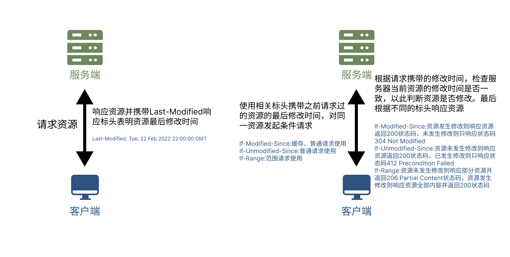

# 条件请求

还记得范围请求以及缓存中所介绍的基于时间/版本的验证请求吗？这些能够携带某些条件发起的请求，被称为条件请求。**条件请求是HTTP的一种内容协商机制，该机制通过在请求中包含特定的标头来告知服务器仅在某些条件得到满足时才响应**。这类请求可以用来验证缓存的有效性，省去不必要的控制手段，帮助减少不必要的数据传输，提高效率，验证文件的完整性，确保资源的一致性和完整性。


## 条件请求的分类

**条件请求正如缓存与范围请求中介绍的那样，分为了基于时间的条件请求与基于版本的条件请求**。


### 基于时间的条件请求

基于时间的条件请求依赖`Last-Modified`响应标头表明资源最后修改时间，依赖`If-Modified-Since`(缓存、普通请求使用)、`If-Unmodified-Since`(普通请求使用)或`If-Range`(范围请求使用)请求标头携带已请求过的资源的最后修改时间，以供服务器检查两资源修改时间是否一致，以此判断资源是否修改。`If-Modified-Since`是指当资源发生了修改则满足条件，提供资源；而`If-Unmodified-Since`与`If-Range`则是指当资源未发生修改则满足条件，提供资源。



基于时间的条件请求工作流程：

- **客户端请求资源**

- **服务端响应资源：** 服务端响应客户端请求资源，并携带`Last-Modified`响应标头表明所请求的资源最后修改时间。

- **客户端发起条件请求：** 客户端根据不同的请求使用相关标头携带之前请求过的资源的最后修改时间，对同一资源发起条件请求。

  ::: tip 不同的请求发起条件请求所使用的标头

  - `If-Modified-Since`:缓存、普通请求使用
  - `If-Unmodified-Since`:普通请求使用
  - `If-Range`:范围请求使用

  :::

- **服务端判断并响应资源：** 根据请求携带的修改时间，检查服务器当前资源的修改时间是否一致，以此判断资源是否修改。最后根据不同的标头响应资源。

  ::: tip 不同标头响应资源的情况

  - `If-Modified-Since`:资源发生修改则响应资源返回`200`状态码，未发生修改则只响应状态码`304 Not Modified`
  - `If-Unmodified-Since`:资源未发生修改则响应资源返回`200`状态码，已发生修改则只响应状态码`412 Precondition Failed`
  - `If-Range`:资源未发生修改则响应部分资源并返回`206 Partial Content`状态码，资源发生修改则响应资源全部内容并返回`200`状态码

  :::

基于时间的条件请求虽然避免了重新传输相同的资源的问题，但它也存在诸多问题：

- **时钟同步问题：** 基于时间的条件请求的前提条件是服务器和客户端的时钟是同步的。如果两者的时钟存在差异，可能会导致验证失败。这种情况下，服务器认为资源已经过期，但实际上客户端的时钟比服务器快或慢，导致了不必要的资源传输。
- **时间精度问题：** 时间戳通常只有秒级别的精度，这可能导致在某些情况下无法检测到资源的真正修改。如果两次修改之间的时间间隔很短，可能无法捕捉到变化。
- **服务器时钟回退：** 如果服务器的时钟回退（例如，由于时钟同步服务的干预），可能会导致客户端认为资源已经过期，尽管实际上它仍然是最新的。
- **资源未被修改但最后修改时间已变：** 有时资源的内容并没有实际修改，但由于某些原因，最后修改时间被更新了。这可能导致不必要的资源传输。

为了解决这些问题，HTTP推出了基于版本的条件请求作为替代方案。


### 基于版本的条件请求

基于版本的条件请求依赖`ETag`响应标头表明资源的版本，依赖`If-None-Match`(缓存、普通请求使用)、`If-Match`(普通请求使用)或`If-Range`(范围请求使用)请求标头携带已请求过的资源的版本，以供服务器检查两资源版本是否一致，以此判断资源是否修改。`If-None-Match`是指当资源发生了修改则满足条件，提供资源；而`If-Match`与`If-Range`则是指当资源未发生修改则满足条件，提供资源。


基于版本的条件请求工作流程：

- **客户端请求资源**

- **服务端响应资源：** 服务端响应客户端请求资源，并携带`ETag`响应标头表明所请求的资源的版本。

- **客户端发起条件请求：** 客户端根据不同的请求使用相关标头携带之前请求过的资源的版本，对同一资源发起条件请求。

  ::: tip 不同的请求发起条件请求所使用的标头

  - `If-None-Match`:缓存、普通请求使用
  - `If-Match`:普通请求使用
  - `If-Range`:范围请求使用

  :::

- **服务端判断并响应资源：** 根据请求携带的资源版本，检查服务器当前资源的版本是否一致，以此判断资源是否修改。最后根据不同的标头响应资源。

  ::: tip 不同标头响应资源的情况

  - `If-None-Match`:资源发生修改则响应资源返回`200`状态码，未发生修改则只响应状态码`304 Not Modified`
  - `If-Match`:资源未发生修改则响应资源返回`200`状态码，已发生修改则只响应状态码`412 Precondition Failed`
  - `If-Range`:资源未发生修改则响应部分资源并返回`206 Partial Content`状态码，资源发生修改则响应资源全部内容并返回`200`状态码

  :::


**为什么范围请求要单独规定一个特点的标头`If-Range`来进行条件请求，而不复用 `If-Unmodified-Since`和 `If-Match`呢？**

确实对于范围请求来说，可以使用`If-Unmodified-Since`和 `If-Match`来进行条件请求，假如前置条件失败，服务器端会返回错误提示，然后客户端可以从头开始重新下载资源：


虽然这种方法行得通，但是它在文件发生变化的情况下增加了一次额外的请求/响应往返，这一点会影响性能。为此 HTTP 协议规定了一个特定的标头—— `If-Range`——来避免这种情况的发生：


::: danger 强验证与弱验证

**强验证与弱验证主要用于基于版本的条件请求，是指服务器判断当前资源的版本与请求所指定的版本是否相匹配的验证模式**。强验证模式下，只有当请求给定的版本与服务器当前版本完全一致时，才会判断两资源相同；而弱验证模式下，只要请求给定的版本与服务器当前版本接近，就会判断两资源相同。通过指`ETag`、`If-None-Match`、`If-Match`或`If-Range`标头的可选的参数` W/`即可指定为弱验证，而默认不指定则为强验证。

:::


## 相关标头

标头`Last-Modified`、`If-Modified-Since`、`ETag`、`If-None-Match`、`If-Range`已在[HTTP缓存](https://wangjunliang.com/HTTP-Explanation/docs/performance-optimization-strategy/http-cache.html)、[范围请求](https://wangjunliang.com/HTTP-Explanation/docs/content-negotiation/range-request.html)章节详细介绍过，因此本节不再重复介绍。


### If-Unmodified-Since `请求标头`

**请求标头`If-Unmodified-Since`指定了一个绝对时间，其值为之前已请求过的内容的最后修改时间（通常由响应标头`Last-Modified`指定），携带该标头希望服务器通过检查当前资源的修改时间与该标头携带时间来判断资源是否发生修改。如果资源未发生修改则响应资源返回`200`状态码，已发生修改则只响应状态码`412 Precondition Failed`**。

**参数**

该请求标头并无其他参数。

**取值**

- **\<date>**

  一个绝对时间，其值为之前已请求过的内容的最后修改时间（通常由响应标头`Last-Modified`指定）

**示例**

```http
If-Unmodified-Since: Wed, 21 Oct 2015 07:28:00 GMT
```


### If-Match `请求标头`

**请求标头`If-Match`指定了一个版本号，其值为之前已请求过的内容的版本号（通常由响应标头`ETag`指定），携带该标头希望服务器通过检查当前资源的版本与该标头携带的版本来判断资源是否发生修改。如果资源未发生修改则响应资源返回`200`状态码，已发生修改则只响应状态码`412 Precondition Failed`**。

**参数**

该请求标头并无其他参数。

**取值**

- **W/** `可选`

  `'W/'`(大小写敏感) 表示使用[弱验证器](https://developer.mozilla.org/zh-CN/docs/Web/HTTP/Conditional_requests#weak_validation)。弱验证器很容易生成，但不利于比较。强验证器是比较的理想选择，但很难有效地生成。相同资源的两个弱`Etag`值可能语义等同，但不是每个字节都相同。

- **"<etag_value>"**

  指定一个版本号，表示希望服务器检查资源是否与给定版本号匹配。

- **\*** `可选`

  星号是一个特殊值，可以代表任意资源。它只用在进行资源上传时，通常是采用 [`PUT`](https://developer.mozilla.org/zh-CN/docs/Web/HTTP/Methods/PUT) 方法，来检测拥有相同识别 ID 的资源是否已经上传过了。

**示例**

```http
If-Match: "bfc13a64729c4290ef5b2c2730249c88ca92d82d"
If-Match: W/"67ab43", "54ed21", "7892dd"
If-Match: *
```


## 本节参考

- https://developer.mozilla.org/zh-CN/docs/Web/HTTP/Conditional_requests
- https://developer.mozilla.org/zh-CN/docs/Web/HTTP/Headers/If-Unmodified-Since
- https://developer.mozilla.org/zh-CN/docs/Web/HTTP/Headers/If-Match

转载需要经过本人同意，并标明出处！

