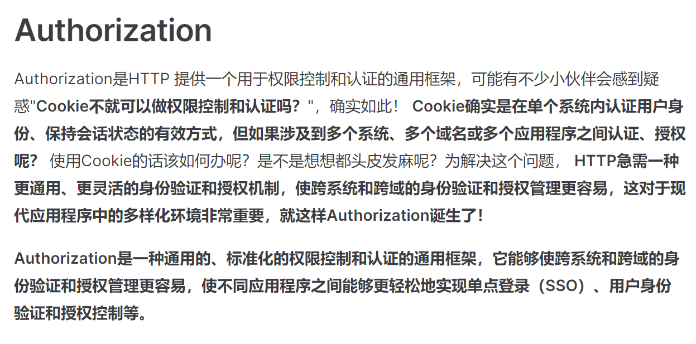
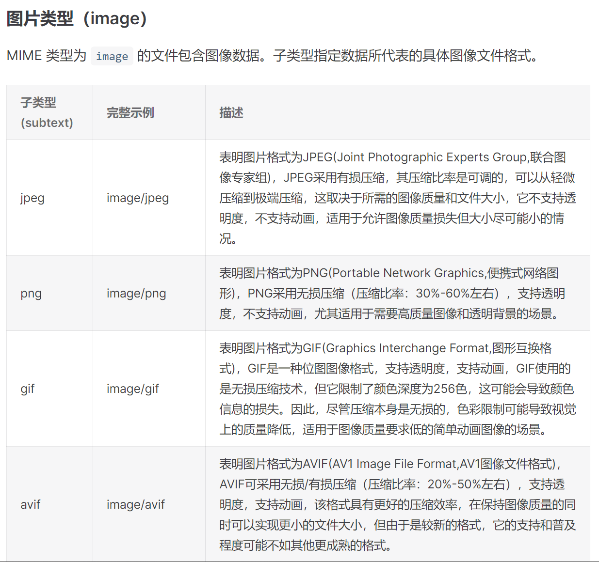

# 这是一份最强HTTP指南

相信大家点开文档看到标题内心嗤之以鼻：“什么玩意敢称最强，标题党，举报了！”，各位同志敲得麻得，让我仔细说说为什么我敢说这是一份最强HTTP指南。

## 清晰的目录结构

对于学习指南而言，清晰的目录结构犹如明亮的灯塔，能够让读者更直观、更轻松地领悟相关知识点。而《HTTP完全注解》恰好有着清晰明确、关联有序、逻辑强性的目录结构。透过目录，我们就能很直观的了解到HTTP的哪些内容解决了怎样的问题，使得学习过程更为流畅。

## 告诉你"其然"，更要告诉你"所以然"

对于目前大部分的指南而言，他们介绍知识点通常仅仅告诉你“是什么”，而不会跟你说“为什么会这样”，每次读到这样的指南时我总是很苦恼。而《HTTP完全注解》不仅仅会告诉你是什么，还会告诉你为什么会这样，例如我在介绍HTTPS时，不但说了HTTPS是什么，还会解释为什么需要HTTPS。

再比如我在介绍Authorization时，不仅仅说了Authorization是什么，怎么用，还解释了为什么需要Authorization。

诸如此类的例子还有很多，比如CSP解决什么问题、为什么需要同源策略，HTTP数据压缩的诞生背景等等，这些“所以然”我想是能够帮助大家更好的理解知识，而不是背知识!

## 全面的知识体系

相信大家看了上述的目录结构也能够直观感受《HTTP完全注解》是一份较为全面的指南，但这里我说的全面并不仅仅是指针对HTTP，而是一些额外的知识点扩展，例如我在MIME类型章节内容中不但介绍了HTTP中有哪些MIME类型，我还扩展解释了这些文件类型有什么区别，适用于哪些场景。

这些例子仍有很多，比如报文Path中的URL编码、Base64等，总之这里的全面不仅仅是针对于HTTP知识的全面介绍，还有一些与HTTP相关的知识的全面介绍，我想这样不仅仅能够扩展大家的技术视野，还能够在日常工作中给大家提供很大的帮助！

## 不仅仅是一份指南

一开始我本身是想写一份关于HTTP的指南，但后来我自己学习使用的时候发现有时候我只是想快速解决问题，而不想看长篇大论的为什么，针对这个问题我为文档加入了搜索功能，这样大家在需要快速解决一些HTTP问题时，就能够通过搜索快速得到答案，并且事后还能够仔细回看，了解为什么！

所以《HTTP完全注解》不仅仅是一份指南，更是一份能够快速解决问题的速查手册！

## 我也在意用户体验

大家学习场景多种多样，有的在地铁上，有的在床上，有的在车上；大家的学习设备也多种多样，有的用手机，有的用电脑，有的用平板。而网页就能够全范围覆盖大家的学习场景以及学习设备，但网页需要搜索，并且无法离线访问，为了解决这个问题，我也为该文档加入了PWA，大家能够把该文档加入桌面随时/离线访问！

## 总结

