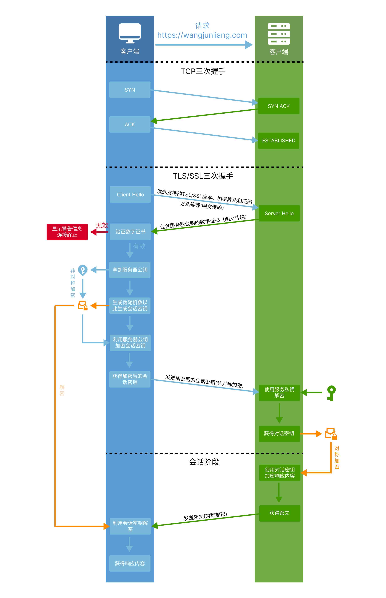
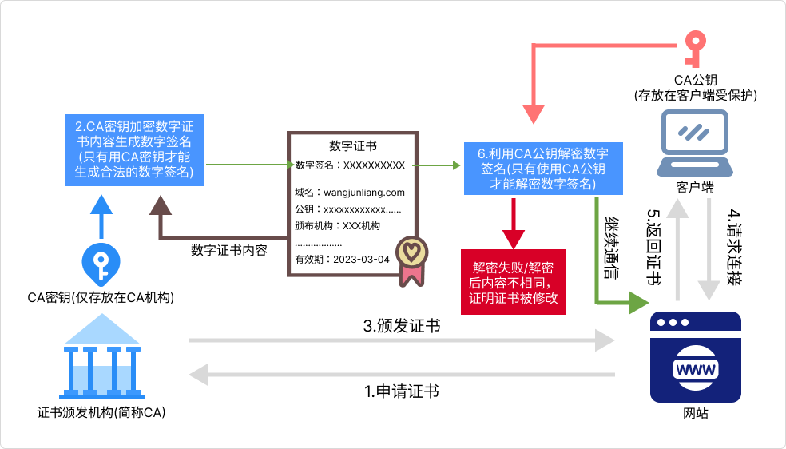
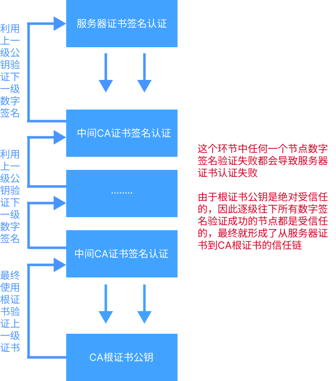

# 拯救不安全的HTTP — HTTPS

Web早期的使用场景都是学校之前传输学术论文，在当时Web几乎就是一个学术网络。由于使用人群单一，使用人数少，相对信任程度很高，因此当时人们并不觉得HTTP使用明文传输有什么不妥。但随着Web的极速发展，社会上越来越多商业、政府组织机构使用这一新生技术来完成自己的业务，HTTP也开始承载着越来越多重要的、私人的信息发往各地。

此时HTTP的安全隐患被逐一暴露出来：

- **通信使用明文传输，内容可轻易窃听获取**

HTTP协议无法加密数据，所有通信数据都在网络中明文“裸奔”，通过网络的嗅探设备及一些技术手段，就可轻易窃听并还原HTTP报文内容。这些个人、重要且隐私的信息就像是被装进了透明信封中，无论信被发往何处， 路过的人总能窥见一二。

> 试想，你周末在咖啡店喝咖啡，连着咖啡店的WI-FI，你使用着银行的网页付款，不幸的是银行网页使用的是HTTP，你的银行账户密码被HTTP以纯文本明文的方式发送了出去，此时任何人都可以通过这个咖啡店的WI-FI拦截到你这个HTTP请求，而HTTP又是纯文本明文，因此他人不费吹灰之力就可以获得你的银行账户密码。

- **无法证明报文的完整性，内容可遭篡改**

HTTP协议无法证明通信的报文完整性，因此，在请求或响应到达接收方这段时间内，即使请求或响应的内容遭到篡改，也没有办法获悉。也就是说，HTTP协议没有任何办法确认，发出的请求和接收到的响应是前后相同的，没有被篡改的。

> 也就是说我通过一定技术手段拦截获取到了"老王转账给张三200元"的HTTP请求，由于HTTP无法证明报文的完整性，因此我可以将获取到的请求篡改为"老王转账给我30000元"，通信双方都不会发现内容已被篡改。

- **不验证通信方的身份，可伪装身份**

HTTP协议中的请求和响应不会对通信方进行身份验证。也就是说，在请求或响应到达接收方这段时间内，请求或响应被拦截伪造之后再次发出，通信双方也无法知晓。

> 此处请勿与Cookie、token等业务层的身份验证混淆，即使你业务层做了身份验证携带了认证参数，但由于在HTTP协议通信时不存在确认通信方的处理步骤，这也意味着一些代理/中转服务器仍可以携带同样且正确的认证参数，然后篡改请求内容后再次发出，由于携带了正确的认证参数，此时业务代码也无法辨识真伪。

**我们根据上述所有HTTP安全隐患，就可以轻易发起一次MitM中间人攻击（Man-in-the-Middle Attack，简称MitM攻击）**

我们通过公共WI-FI以及一定技术手段拦截获取到了一个HTTP转账请求，由于HTTP使用明文传输我们轻易知道了这笔转账的具体信息以及相关参数，我们将这笔转账的接收方改为我自己并且将转账金额变大之后再次发出，由于HTTP无法证明报文的完整性且不验证通信方的身份，因此我们即使篡改了请求内容并再次发出通信双方也感知发现的。

::: danger MitM中间人攻击(Man-in-the-Middle Attack，简称MitM攻击）

MitM是一种常见的网络攻击方式，攻击者通过在通信过程中插入自己作为中间人的角色，窃取或篡改通信内容。MITM攻击的基本原理是攻击者在通信的两端之间插入自己的存在，使得双方都认为他们在与对方直接通信，但实际上所有的通信都经过了攻击者的窃听和干扰。


:::


因为上述HTTP种种安全隐患，人们对一个加密传输层的需求开始愈发高涨，于是乎HTTPS诞生了！

<br>

## HTTPS

**HTTPS（Hypertext Transfer Protocol Secure，超文本传输协议安全）是基于HTTP协议的安全版本，它通过在HTTP上建立SSL（Secure Sockets Layer）或TLS（Transport Layer Security）加密层，使得HTTP通信具备身份验证、信息加密和完整性校验的功能，以解决HTTP中的种种安全问题。**


::: tip 提示

传输层安全性协议 (Transport Layer Security，缩写作 TLS)，它的前身是安全套接层 (Secure Sockets Layer，缩写作 SSL)，是一个被应用程序用来在网络中安全通信的通讯协议，防止电子邮件、网页、消息以及其他协议被篡改或是窃听。

所有现代浏览器都支持 TLS 协议，它们都要求服务器提供一个有效的[digital certificate](https://developer.mozilla.org/zh-CN/docs/Glossary/Digital_certificate)（数字证书）来确认身份以建立安全连接。如果客户端和服务器都能提供自己的数字证书，则它们可以互相认证。

:::

<br>

## HTTPS工作流程



<br>

### TCP三次握手


由于HTTPS仍是建立在TCP的基础上的，因此建立会话仍是需要进行TCP三次握手的。当然，HTTPS也可以使用已有的TCP连接，直接直接进行TLS/SSL三次握手，而不需要进行TCP三次握手。

<br>

### TLS/SSL首次握手：ClientHello(明文传输)


一旦TCP连接建立，客户端会以明文的方式发送TLS/SSL的ClientHello消息，该消息包含一下信息：

- **支持的TLS/SSL版本**
- **支持的加密套件列表，包括密码学算法和密钥交换算法的组合**
- **支持的压缩方法**
- **可选的TLS扩展，如Server Name Indication (SNI) 等**

ClientHello消息主要用于通知服务器客户端包含了哪些支持的TLS版本号、密码套件列表（包括加密算法和密钥交换算法）、支持的压缩方法等信息。服务器会根据这些信息来选择合适的加密算法和密钥交换方式，以确保通信的机密性和完整性。

**虽然ClientHello消息是明文传输，但由于ClientHello消息传输的都是一些连接协商内容，它不重要且不隐私，因此即使被中间人监听也不影响，中间人篡改其中内容也没必要，因为篡改其中内容并没有价值，并且篡改内容只可能会导致客户端/服务器协商失败断开连接。**

<br>

### TLS/SSL二次握手：ServerHello(明文传输)


服务器接收到客户端发来的ClientHellow 消息后，会从客户端支持的TLS/SSL版本选择一个，这通常是客户端支持的最高版本，从客户端提供的加密套件列表中选择一个合适的套件，该套件包括加密算法、密钥交换算法等。在选择完成后会向客户端返回一个ServerHello消息，该消息也是明文传输，包含以下内容：

- **建立通信的参数：** 包括选择的TLS 版本号、加密套件等信息
- **数字证书：** 这个证书包含服务器的公钥、域名、证书有效期等相关的信息，客户端可以使用该证书来验证服务器的身份。
- **证书链：** 服务器通常会返回一个证书链，包括服务器证书和中间CA证书。这个证书链允许客户端验证服务器证书的有效性，并建立信任链。

<br>

### 数字证书

**数字证书就像一个许可证，需要向第三方权威机构(证书颁发机构，Certificate Authority简称CA)申请，以许可该站点能够使用HTTPS**，数字证书包含了域名(允许哪个站点使用HTTPS)、有效期(允许使用的时间段)，服务器公钥(传输的信息使用该公钥加密后，只能使用服务器的私钥才能解密)、颁发者信息等等内容。



**此时大家可能会有疑问“使用明文传输数字证书，不是很容易被中间人拦截篡改吗？”**

数字证书时难以篡改的，这是为什么呢？答案就是数字签名。数字签名是证书颁发机构（CA）的私钥基于证书的内容创建的，包括证书的公钥、域名、颁发者信息、有效期等等。只有持有相应私钥的证书颁发机构才能有效地签署证书，个人通常是无法获得的。

拿到数字证书的客户端会根据CA证书的公钥来验证证书的数字签名是否合法，由于数字签名是基于CA证书密钥与内容创建的，因此篡改其内容都会导致证书验证不合法。并且CA证书的公钥存储受到系统或浏览器的保护，以防止未经授权的更改。

直接修改证书会导致客户端验证证书不合法，如果想要获取到CA证书的私钥，或是替换掉客户端的公钥也是极其困难的，替换整个数字证书更不可行，因为请求域名都不一样，因此想要篡改数字证书时极其困难的。

**为什么数字证书难以篡改**

- **数字证书的数字签名是证书颁发机构（CA）的私钥基于证书的内容创建的，包括证书的公钥、域名、颁发者信息、有效期等等。只有持有相应私钥的证书颁发机构才能有效地签署证书，个人通常是无法获得私钥的，因此想要通过获取私钥自行签署数字签名也是不可行的。**
- **客户端拿到数字证书会根据CA证书的公钥来解密数字签名，解析失败或解析后内容与证书内容不同，证明证书已被篡改，由于CA证书公钥存放在受保护的地方，因此想要通过修改存储在客户端的CA证书公钥来通过验证也是极其困难的。**
- **替换整个数字证书更不可行，因为解析完成数字签名后，客户端会发现数字证书的域名怎么与请求域名不一样**

<br>

### 证书链

在现实中并不是由一个证书颁发机构颁发所有证书的，而是设立了一个根证书颁发机构，然后设立了若干层中间证书颁发机构，由上一级颁发机构去颁发验证下一级证书颁发机构的数字证书，直到服务器证书。**证书链就是从根证书，然后经过的若干中间证书，最后到服务器证书这一条链路**。


**为啥要这么多中间证书颁发机构呢？直接使用根证书颁发机构颁发所有证书不可以吗？**

使用多个中间证书颁发机构（Intermediate CAs）的主要原因是安全性和管理的考虑。虽然理论上可以只使用根证书颁发机构（Root CA）颁发所有证书，但多级证书颁发机构体系更加灵活安全。它允许根证书颁发机构将部分权威委托给中间证书颁发机构，从而使中间机构可以颁发证书，同时根机构仍然保持根源信任。这种灵活性允许更好地管理证书颁发和吊销，以及适应组织的复杂结构，有助于隔离风险。如果中间证书颁发机构的私钥被泄漏或被滥用，只需吊销中间机构的证书，而不必吊销根证书颁发机构的证书。

**为什么服务器要给客户端发送证书链？**

由于服务器证书是经过若干层中间证书，最终才到达根证书生成的，如果仅发送服务器仅发送服务器证书给客户端，客户端是无法知晓颁发给服务器证书的上层机构是谁，因此无法验证服务器证书的数字签名。



服务器发送证书链給客户端，客户端就可以从服务器证书逐级验证中间证书，最终到达根证书。由于根证书公钥是绝对受信任的，因此逐级往下所有数字签名验证成功的证书都是受信任的，最终就形成了从服务器证书到CA根证书的信任链。

<br>

### TLS/SSL三次握手：发送会话密钥(非对称加密，利用服务器公钥)


客户端在接收到服务器发送的数字证书后会根据上述验证[数字证书](#数字证书)/[证书链](#证书链)的方式验证数字证书。验证失败则会直接报错然后断开连接，如果验证成功，则会先拿到服务器公钥，生成一个伪随机数，然后根据这个随机数生成会话密钥，最终利用服务器公钥对会话密钥进行非对称加密，最后将加密后的会话密钥发送给服务端。**由于非对称加密只能使用服务器私钥解密，因此中间人即使拦截到了经过公钥加密的密文，由于没有私钥也无法解密，因此也无法获得会话密钥，所以经过上述握手，客户端服务端双方都可以确认会话密钥是绝对安全的**。

服务器接收到加密的会话密钥后会使用其私钥进行解密，然后拿到会话私钥，至此就完成了TSL/SSL三次握手，并进入会话阶段。

::: tip 非对称加密


非对称加密通俗点解释就是一把锁有两把钥匙，其中一把称为公钥，它并且只有它能关锁(也就是加密)；另一把称为私钥，它并且只有它能开锁(也就是解密)。由于私钥仅存放在服务器受保护的地方，因此中间人即使拦截到了经过公钥加密的密文，由于没有私钥也无法解密。

:::

<br>

### 会话阶段：发送响应内容(对称加密，利用会话密钥)


服务器拿到密钥后，TSL/SSL的三次握手就完成了并进入会话阶段。经过上述握手过程，客户端服务端双方都可以确认会话密钥是绝对安全的，因此在会话阶段双方通信内容就可以使用会话密钥进行对称加密。

::: tip 对称加密

对称加密通俗点解释就是一把锁只有一把钥匙，开关锁(加解密)都是用这一把钥匙，称为密钥。只要将密钥妥善保管，不泄露，中间人即使拦截到了经过密钥加密的密文，由于没有密钥也无法解密。


:::

<br>

### 为什么TSL/SSL握手阶段使用非对称加密，而会话阶段使用对称加密?

虽然非对称加密在某些方面非常强大，但它也有一些限制和性能方面的不足，这些限制使得在通信中不适合全部使用非对称加密。

- **性能问题**：非对称加密算法（如RSA或ECC）比对称加密算法（如AES）更复杂，因此在加密和解密数据时需要更多的计算资源和时间。这对于大量的数据传输或高流量的网络来说可能是一个性能瓶颈。
- **密钥管理**：非对称密钥对（公钥和私钥）的管理相对复杂。在一个大型网络中，管理数以千计的密钥对会变得非常困难。对称加密只需要一个密钥，因此更容易管理。
- **前向保密性**：非对称加密通常不提供前向保密性（Forward Secrecy），这意味着如果私钥被泄露，攻击者可以解密以前拦截的加密数据。而对称加密的前向保密性可以更好地防止这种情况。
- **密钥长度**：为了提供相同级别的安全性，非对称密钥通常需要更长的密钥长度，这会增加数据传输的开销。

对称加密在某些情况下是非常高效和快速的，但它也有一些限制，这些限制使得不适合全部使用对称加密：

- **密钥分发问题**：对称加密需要双方共享相同的密钥，这就引入了密钥分发的问题。如果双方在通信之前没有共享密钥，那么他们需要一个安全的方式来传输密钥。这个过程可能容易受到中间人攻击或者其他安全问题的影响。
- **缺乏身份验证**：对称加密本身并不提供身份验证机制，这意味着在通信开始之前，没有办法确定通信的另一方是否真的是合法的目标。这使得对称加密容易受到伪装攻击的影响。
- **前向保密性**：对称加密通常不提供前向保密性，这意味着如果密钥被泄露，攻击者可以解密以前拦截的加密数据。
- **密钥轮换**：在对称加密中，密钥的轮换和管理可能会更复杂，特别是在大型系统中。如果密钥不定期轮换，或者如果密钥丢失或泄露，整个通信系统的安全性可能会受到威胁。

因此，通常情况下，加密方案会采用混合加密的方法，结合对称加密和非对称加密的优点。在通信开始时，使用非对称加密来安全地协商共享的对称密钥，然后在通信会话中使用对称加密来保护实际的数据传输。这种混合加密方法能够同时提供安全性和性能，解决了对称加密和非对称加密各自的限制。

<br>

## HTTPS也不绝对安全

HTTPS确实提供了一定程度的安全性，但它并非绝对安全，仍然存在一些潜在的风险和攻击向量

- **会话密钥泄露** ：在HTTPS握手过程中，客户端和服务器会交换用于加密通信的会话密钥。如果会话密钥泄露或恶意方能够通过一定手段获取这个会话密钥，他们就可以解密通信内容。
- **客户端发送会话密钥服务端通常不验证客户端身份** ： 这是一种称为单向认证的模式，其中服务器验证自己的身份，但不要求客户端提供证书或其他身份验证信息。虽然这在许多互联网应用中很常见，但它确实意味着恶意客户端可以连接到服务器，而服务器难以验证客户端的真实身份。
- **证书链中任何一个节点被污染或私钥泄露，包括服务器私钥** ：证书链是用于验证服务器身份的关键组成部分。如果证书链中的任何一个证书受到污染或者私钥泄露，攻击者可能会冒充合法的服务器进行中间人攻击，这会损害通信的机密性和完整性。
- **客户端证书链中任何一个节点公钥被污染替换** ： 类似于服务器证书链，客户端证书链中的污染或替换也可能导致安全问题。这通常涉及到客户端的身份验证，如果恶意方能够替换客户端证书链中的公钥，他们可能会冒充合法客户端与服务器通信。
- **没有妥善处理HTTP到HTTPS的重定向** :如果一个网站接受 HTTP 的请求，然后重定向到 HTTPS，用户可能在开始重定向前，通过没有加密的方式与服务器通信，比如，用户输入 `http://foo.com` 或者仅是输入 foo.com。这样为中间人攻击创造了机会。可以利用重定向将用户引导至恶意站点，而不是原始站的安全版本。

<br>


## HTTP重定向HTTPS的安全隐患

如果一个网站接受 HTTP 的请求，然后重定向到 HTTPS，用户可能在开始重定向前，通过没有加密的方式与服务器通信，比如，用户输入 `http://foo.com` 或者仅是输入 foo.com。这样为中间人攻击创造了机会。可以利用重定向将用户引导至恶意站点，而不是原始站的安全版本。

>你登录到一个免费 Wi-Fi 热点，然后开始浏览网站，访问你的网上银行，查看你的支出，并且支付一些订单。很不幸，你接入的 Wi-Fi 实际上是黑客的笔记本热点，他们拦截了你原始的 HTTP 请求，然后重定向到一个与你银行网站一模一样的钓鱼网站。现在，你的隐私数据暴露给黑客了。

为解决这一问题，HTTP推出了**HSTS(HTTP Strict Transport Security Preload，安全的预加载)**，它通过设置HTTP[响应标头](../overview/http-message-format.html#%E6%B6%88%E6%81%AF%E5%A4%B4)中的`Strict-Transport-Security`字段，要求浏览器在与特定网站通信时强制使用HTTPS连接，从而减少中间人攻击的风险。


### Strict-Transport-Security`响应标头`

HTTP **`Strict-Transport-Security`**（通常简称为 [HSTS](https://developer.mozilla.org/zh-CN/docs/Glossary/HSTS)）响应标头用来通知浏览器应该只通过 HTTPS 访问该站点，并且以后使用 HTTP 访问该站点都应自动重定向到 HTTPS。

#### 参数

- **max-age=< expire-time >**

  只能使用 HTTPS 访问该站点的有效期（以秒为单位）

- **includeSubDomains** `可选`

  如果这个参数存在，那么代表此规则也适用于该网站的所有子域名

- **preload**  `可选` `非标准`

  如果该参数存在，意味着该站点希望并且可以申请加入到google提供的[HSTS预加载列表站点](https://hstspreload.org/)

#### 示例

```http
// 该域名会自动使用 HTTPS，有效期（max-age）为一年。
Strict-Transport-Security: max-age=31536000
// 该域名与其所有子域名会自动使用 HTTPS，有效期（max-age）为一年。
Strict-Transport-Security: max-age=31536000; includeSubDomains
// 该域名与其所有子域名会自动使用 HTTPS，有效期（max-age）为一年。
// 且该站点希望并且可以申请加入到google提供的HSTS预加载列表站点
Strict-Transport-Security: max-age=<expire-time>; includeSubDomains; preload
```

:::danger Strict-Transport-Security使用HTTP访问时无效

`Strict-Transport-Security` 标头在通过 HTTP 访问时会被浏览器**忽略**。只有在你的网站通过 HTTPS 访问并且没有证书错误时，浏览器才认为你的网站支持 HTTPS，然后遵守 `Strict-Transport-Security` 标头。浏览器这样做是因为如果该标头在HTTP中有效，中间人也可以通过拦截站点的 HTTP 连接的，然后篡改注入或者删除该标头来达成目的。

:::


#### 浏览器是如何处理的

你的网站第一次通过 HTTPS 请求，服务器响应 `Strict-Transport-Security` 标头，浏览器记录下这些信息，然后后面尝试访问这个网站的请求都会自动把 HTTP 替换为 HTTPS。

当 `Strict-Transport-Security` 标头设置的过期时间到了，后面通过 HTTP 的访问恢复到正常模式，不会再自动重定向到 HTTPS。

每次浏览器接收到 Strict-Transport-Security 标头，它都会更新这个网站的过期时间，所以网站可以刷新这些信息，防止过期发生。如果有禁用 Strict-Transport-Security 的需求，将 `max-age` 设置为 0（通过 https 连接）将立即使 `Strict-Transport-Security` 标头失效，从而可以通过 http 访问。


#### 预加载 HSTS

从上述危险提示中我们知道`Strict-Transport-Security` 标头在HTTP中是无效的，因此用户第一次并且使用HTTP访问站点时，同样可能遭受中间人攻击，被引导至钓鱼网站。

为解决这个问题，Google维护着一个**HSTS 预加载列表**，当你的响应中`Strict-Transport-Security` 标头包含了`preload`参数，你就可以向Google提供的[HSTS预加载列表站点](https://hstspreload.org/)提交你的域名，以申请加入HSTS预加载列表中

浏览器厂商会定期更新他们的HSTS预加载列表，并将符合条件的网站添加到列表中。一旦网站被包括在HSTS预加载列表中，浏览器将自动应用HSTS策略，即使用户首次以HTTP链接方式访问该网站。


<br>

## 总结

### HTTP与HTTPS的区别

| HTTP               | HTTPS           |
| ------------------ | --------------- |
| 明文传输           | 加密传输        |
| 不进行身份验证     | 进行身份验证    |
| 无法验证报文完整性 | 报文完整性保护  |
| 一般使用80端口     | 一般使用443端口 |
| ...                | ...             |


### HTTPS的工作流程


### 并非绝对安全的HTTPS

- **会话密钥泄露** ：在HTTPS握手过程中，客户端和服务器会交换用于加密通信的会话密钥。如果会话密钥泄露或恶意方能够通过一定手段获取这个会话密钥，他们就可以解密通信内容。
- **客户端发送会话密钥服务端通常不验证客户端身份** ： 这是一种称为单向认证的模式，其中服务器验证自己的身份，但不要求客户端提供证书或其他身份验证信息。虽然这在许多互联网应用中很常见，但它确实意味着恶意客户端可以连接到服务器，而服务器难以验证客户端的真实身份。
- **证书链中任何一个节点被污染或私钥泄露，包括服务器私钥** ：证书链是用于验证服务器身份的关键组成部分。如果证书链中的任何一个证书受到污染或者私钥泄露，攻击者可能会冒充合法的服务器进行中间人攻击，这会损害通信的机密性和完整性。
- **客户端证书链中任何一个节点公钥被污染替换** ： 类似于服务器证书链，客户端证书链中的污染或替换也可能导致安全问题。这通常涉及到客户端的身份验证，如果恶意方能够替换客户端证书链中的公钥，他们可能会冒充合法客户端与服务器通信。
- **没有妥善处理HTTP到HTTPS的重定向** :如果一个网站接受 HTTP 的请求，然后重定向到 HTTPS，用户可能在开始重定向前，通过没有加密的方式与服务器通信，比如，用户输入 `http://foo.com` 或者仅是输入 foo.com。这样为中间人攻击创造了机会。可以利用重定向将用户引导至恶意站点，而不是原始站的安全版本。

<br>

::: details  🎈本节参考

- https://ahrefs.com/blog/zh/what-is-https/
- https://www.cloudflare.com/zh-cn/learning/ssl/what-happens-in-a-tls-handshake/
- https://www.cloudflare.com/zh-cn/learning/ssl/what-is-https/
- https://juejin.cn/post/6844903830916694030?searchId=202309121530495DECE5548548A7CA327B#heading-11
- https://zh.wikipedia.org/zh-hans/%E8%B6%85%E6%96%87%E6%9C%AC%E4%BC%A0%E8%BE%93%E5%AE%89%E5%85%A8%E5%8D%8F%E8%AE%AE
-  《图解HTTP》

- https://developer.mozilla.org/zh-CN/docs/Glossary/HSTS
- https://developer.mozilla.org/zh-CN/docs/Web/HTTP/Headers/Strict-Transport-Security

:::

转载需要经过本人同意，并标明出处！